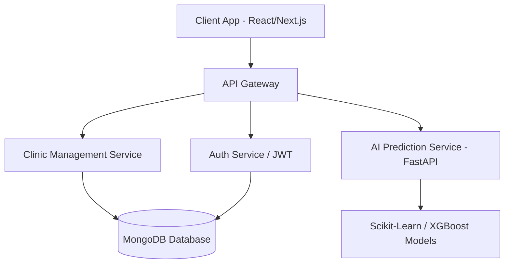
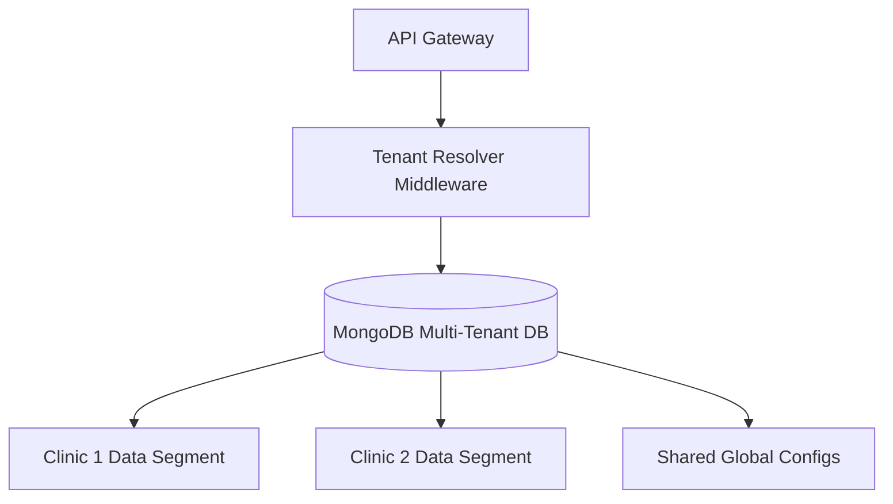
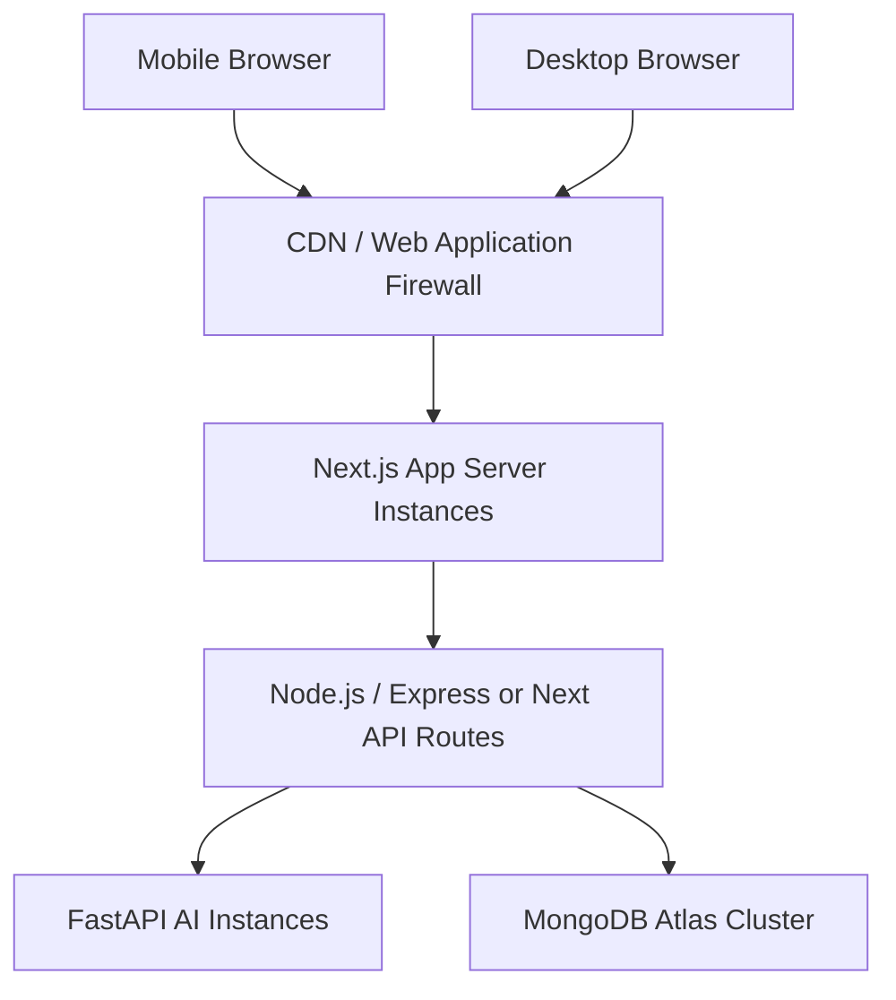
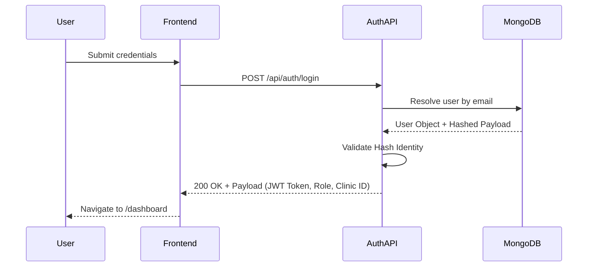
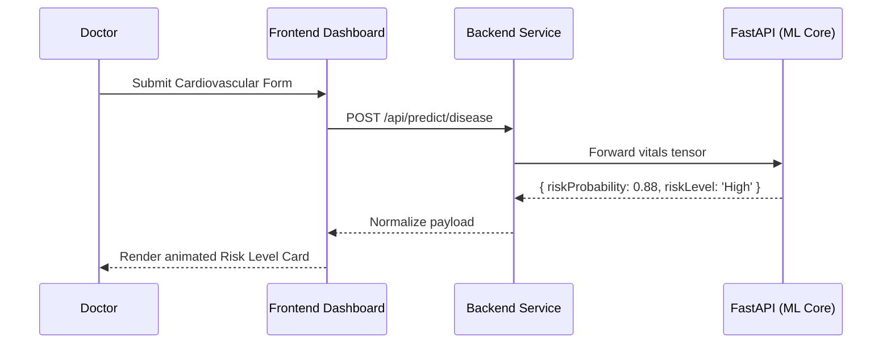

# 4. System Architecture

## High-Level Architecture Diagram



## Multi-Tenant Architecture Diagram



## Deployment Diagram



---

# 15. Activity Diagrams

## Login Activity Diagram

```mermaid
activityDiagram
    start
    :User submits credentials;
    :System validates username and password;
    if (Valid credentials?) then (yes)
        :Generate JWT Token;
        :Determine User Role and Clinic ID Scope;
        :Route frontend to personalized Dashboard;
    else (no)
        :Reject and display authentication error;
    endif
    stop
```

## Appointment Booking Activity Diagram

```mermaid
activityDiagram
    start
    :Select Patient & Doctor;
    :Select desired Date & Time Slot;
    :System validates time slot availability;
    if (Available?) then (yes)
        :Generate Appointment Document;
        :Link Document to active `clinicId`;
        :Save to Database;
    else (no)
        :Prompt user to choose alternate slot;
    endif
    stop
```

## AI Prediction Workflow

```mermaid
activityDiagram
    start
    :Doctor inputs medical observations (vitals);
    :System packages JSON payload for FastAPI;
    :FastAPI sanitizes inputs and routes to ML Model;
    :Model processes inference (model.predict);
    :System determines Risk Percentage and Risk Level;
    :Display risk visualization on UI;
    stop
```

## Prescription Generation

```mermaid
activityDiagram
    start
    :Doctor selects Medication from database;
    :Doctor inputs Route, Dosage, Frequency, and Duration;
    :System commits Prescription to Patient EMR;
    stop
```

---

# 16. Sequence Diagrams

## Authentication Sequence Diagram



## Disease Prediction Sequence Diagram



---

# 18. System Design

## Frontend Architecture

The system employs React (19) alongside Next.js (15). Using a combination of Server-Side Rendering (SSR) for static elements and Client-Side Rendering (CSR) for highly interactive UI forms guarantees performance. The UI adheres to Tailwind CSS for design consistency, and relies strictly on Context providers (`AuthContext`) for tracking tenant IDs.

## Backend Architecture

Node.js architecture acts as the intermediate routing layer. Database requests utilize mapping utilities (like Mongoose models) where each database access operation strictly isolates based on a `clinicId` injected securely via JWT payload middleware.

## AI Architecture

AI operations are cleanly decoupled into a standalone FastAPI server. Exposing Scikit-learn and XGBoost pipelines via REST implies that scaling the memory-intensive ML capabilities does not throttle the lightweight CRUD Node.js operations.

---

# 19. Component Diagram

```mermaid
componentDiagram
    package "Sehati User Interfaces" {
        [Global Dashboard]
        [Patient Directory Grid]
        [Appointments View]
        [Predictive Health Layouts]
        [Global Search Command]
    }

    package "Business API Gateway" {
        [Authentication Controller]
        [Clinical Records Controller]
        [Analytics Engine]
    }

    package "Machine Learning Layer" {
        [FastAPI Endpoint Router]
        [Logistic Regression Predictor]
        [XGBoost Matrix Compute]
    }

    [Predictive Health Layouts] --> [FastAPI Endpoint Router]
    [Patient Directory Grid] --> [Clinical Records Controller]
    [Global Search Command] --> [Clinical Records Controller]
```
