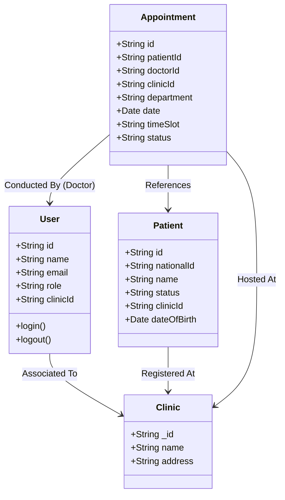
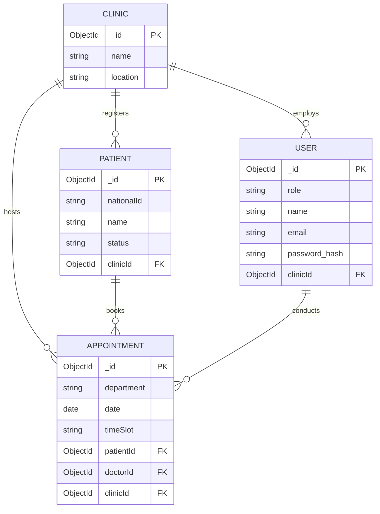

# 20. Class Diagram

---

# 21. Entity Relationship Diagram (ERD)

---

# 22. Mapping

## Database Mapping Strategy

The MongoDB database uses logical schemas established directly from the classes presented above. To ensure architectural integrity and support real-world clinic chains, standard document stores implement an automatic tenancy enforcement mapping rule:

- Except for global documents (such as system-wide standard Clinic locations or Super Admin users), **every single Schema must implement a required `clinicId` field**.
- The Node API layer contains routing middleware that automatically asserts that any given REST verb carries an implicit condition `{ clinicId: req.user.clinicId }`. This ensures absolute mathematical partitioning.

## API Response Mapping

API responses map Mongoose/MongoDB data aggregates into constrained standard JSON types before delivering them to the React frontend.

## Data Transfer Object (DTO) Mapping

To enhance security and normalize types:

- **Database Models** inherently hold backend-specific fields like `__v` or internal `_id` and sensitive flags (like password hashes).
- Before bridging data onto the web protocol, the Node controller filters records into **DTOs** containing normalized `id` fields and only necessary parameters. The `src/types.ts` typescript interface file explicitly mirrors this frontend DTO contract.
