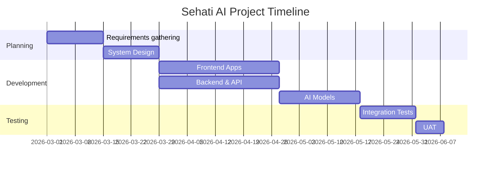

# Cover Page

- **Cairo University**
- **Faculty of Graduate Studies for Statistical Research**
- **Department Name:** Computer Science / Information Technology
- **Project Title:** Sehati AI
- **Team Members:** [Student Names]
- **Supervisor Name:** [Supervisor Name]
- **Date:** 2026-06-19

---

# Table of Contents

1. [Introduction](#1-introduction)
2. [Scope](#2-scope)
3. [Purpose](#3-purpose)
4. [Project Duration](#10-project-duration)

_(See separate files for detailed System Architecture, Requirements, Database, API mapping, AI Models, and Testing.)_

---

# 1. Introduction

## Background

The healthcare industry is undergoing a digital transformation. Moving from paper-based records to Electronic Medical Records (EMRs) improves clinical efficiency. Standard systems, however, rely heavily on legacy structures that lack predictive intelligence and multi-tenant capabilities.

## Healthcare Challenges

- Fragmented patient data.
- High overhead for clinic administration.
- Reactive rather than proactive disease management.
- Lack of robust multi-tenant data isolation for cloud systems serving multiple independent hospital branches.

## Importance of AI in healthcare

AI helps transition healthcare from reactive approaches to predictive care. By analyzing patient vitals, genetic histories, and lab results, AI can flag high-risk patients for diseases such as Diabetes, Hypertension, and Cardiovascular complications before severe symptoms manifest.

## Overview of Sehati AI

Sehati AI is an AI-powered, multi-tenant Clinical Information System. It serves various administrative and clinical roles (Super Admin, Clinic Admin, Doctor, Receptionist, Patient) while ensuring strict mathematical isolation of data between different clinics. It pairs predictive machine learning capabilities (Scikit-learn, XGBoost via a FastAPI backend) with a reactive frontend (Next.js, React, Tailwind CSS) connected to a scalable MongoDB database.

---

# 2. Scope

## System Boundaries

Sehati AI encompasses the clinic administration workflows, electronic medical records (EMR), appointment scheduling, and AI-driven predictive health assessments.

## Included Features

- Multi-tenant data segregation (Clinic-based).
- Role-based access control (Super Admin, Clinic Admin, Doctor, Receptionist, Patient).
- Patient directory and detailed EMR management.
- Appointments scheduling and agenda overviews.
- AI Agent & Predictive Disease Detection tools.
- Persistent Global Search functionality.

## Excluded Features

- External accounting system integrations.
- Physical pharmacy inventory management software.
- Direct integration with physical imaging hardware.

---

# 3. Purpose

## Business Goals

- Deliver a scalable SaaS platform for clinical management.
- Drastically decrease administrative friction and UI overhead.
- Improve patient retention through predictive, preventative care interactions.

## User Goals

- **Doctors:** Quick access to patient histories and AI-driven predictive overlays to support decision-making.
- **Receptionists:** Efficient booking workflows and simplified patient profile registry.
- **Patients:** Easy visibility into their past visits and scheduled appointments.

## Clinical Goals

- Improve early-stage detection of chronic anomalies.
- Uphold strict data security via isolated database multi-tenancy.
- Standardize clinical observation workflows.

---

# 10. Project Duration

## Milestones

1. **Requirements & Design:** Weeks 1-3
2. **Frontend Development:** Weeks 4-7
3. **Backend & Database Setup:** Weeks 8-11
4. **AI Model Training & Integration:** Weeks 12-14
5. **Testing & QA:** Weeks 15-16
6. **Deployment & UAT:** Weeks 17-18

## Sprint Plan

- **Sprint 1-2:** UI/UX Mockups, Tailwind Configuration.
- **Sprint 3-4:** User Auth (JWT), RBAC Setup.
- **Sprint 5-6:** Patients, Clinics, and Appointments Modules.
- **Sprint 7-8:** EMR Dashboard & AI Predictive Forms Integration.

## Timeline

